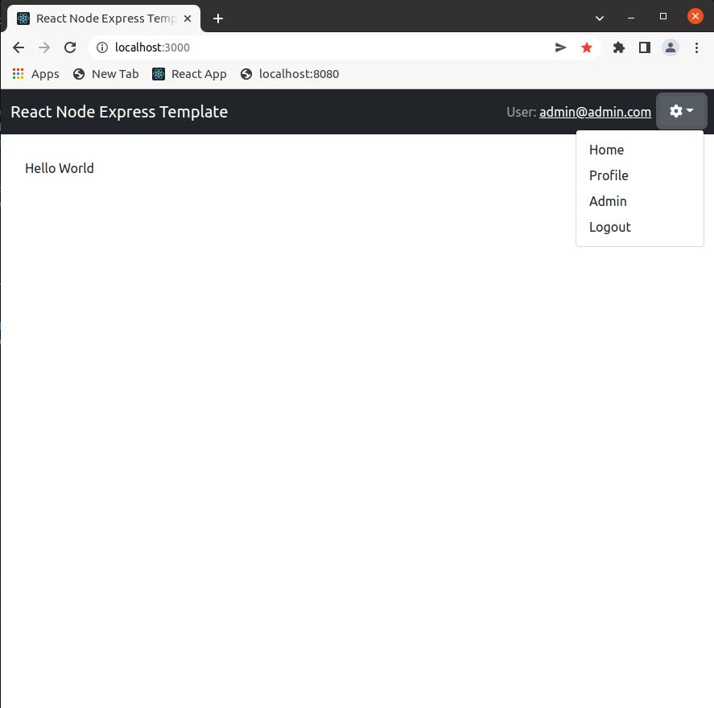
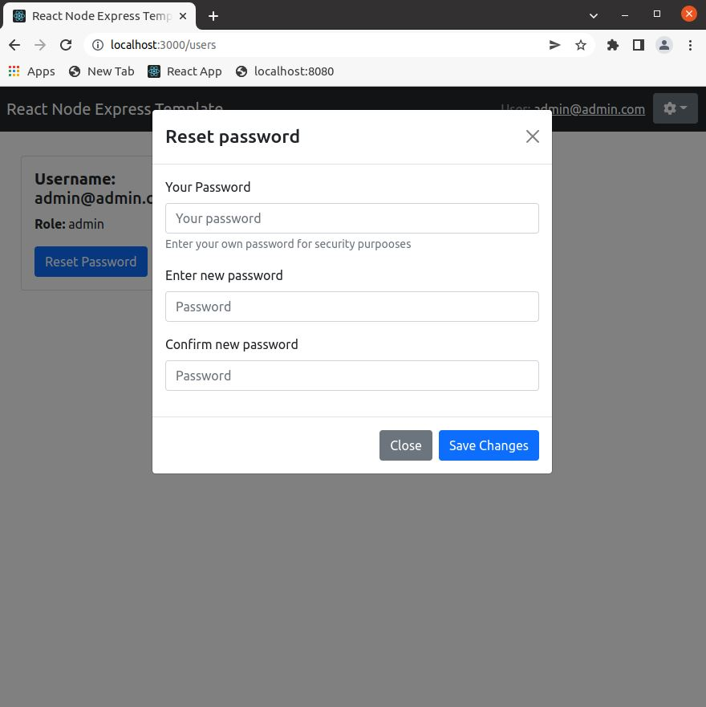
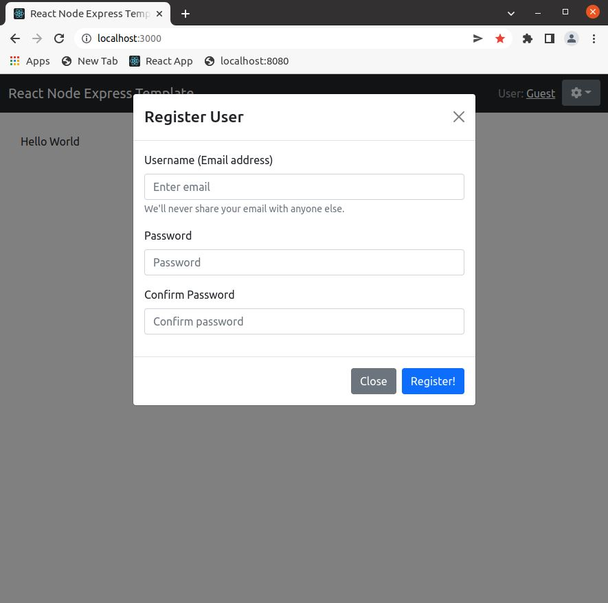
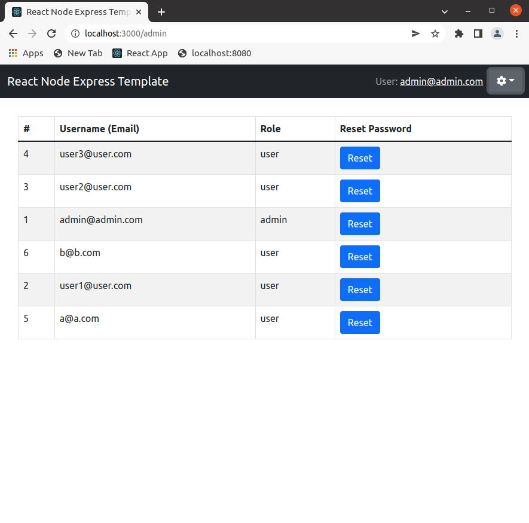

# ReactJS Node Express Webapp Template

A basic template for web applications using the PERN stack (PostgresSQL, Express, React, Node)



## Features

### Basic user management

Users held within a PostgreSQL DB and authentication managed using access/refresh JWT tokens. Ability to login/logout and register new users. Users either have a role of Admin or User. 

Users who login can update their own password and view some basic information about their account. 





### User Administration Dashboard

If logged in as an Admin, they can reset the password of other users.



## Getting Started

```
Run npm install in both the root and client folders

In root folder run:
npm install
npm run db:reset
npm run db:seed
npm start

In a seperate command window within client folder run:
npm install
npm start
open http://localhost:3000
```

The *npm run db:reset* command will drop application DB tables and rebuild them (removing any data) based off bin/resetdb.js.

The *npm run db:seedusers* command will rerun the seed data file within bin/seed.js and password data from the .env file

If deployed to Heroku environment, the lib/db.js file will recognize that the DATABASE_URL config var that is automatically created by Heroku and will connect using that instead. 

## Dependencies

- Node 10.x or above
- NPM 5.x or above
- PG 6.x

## Contact

- Email: Kevin.rph.lee@gmail.com